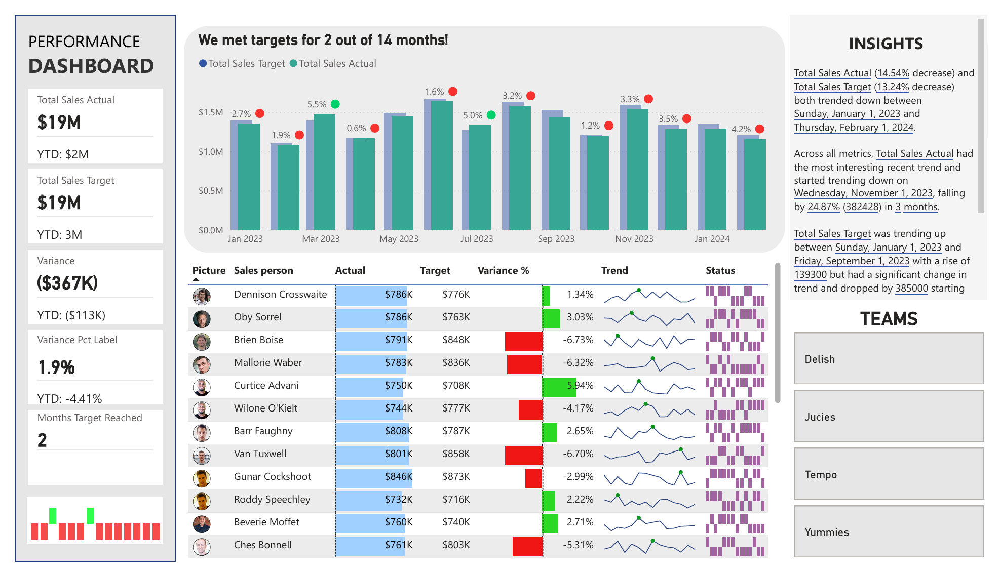

# Financial KPI Dashboard

Make an incredible Power BI Dashboard to visualize your finance KPI data. In this dashboard, learn how to take raw business data and turn it into useful insights by following these 4 steps:

1) Data Preparation - Connecting and transforming data using Power Query in Power BI
2) Data Modelling - Setting up a semantic model in Power BI with table relationships.
3) Calculations - Performing necessary number crunching using the DAX in Power Pivot
4) Dashboard Visuals & Interactions - Creating and customizing various visuals to generate our KPI dashboard. 

Key topics / ideas you will learn are:
1) Power Query unpivot
2) Data Modelling with multiple fact tables
3) DAX calculations for YTD values
4) Using Emoji with DAX
5) Using FILTER function in DAX
6) Working with the "NEW" card visual and reference labels
7) Using custom data labels with graphs
8) Sparklines in table visual
9) Working with Power BI report themes
10) Smart narrative feature of Power BI
11) Table formatting for executive reporting

